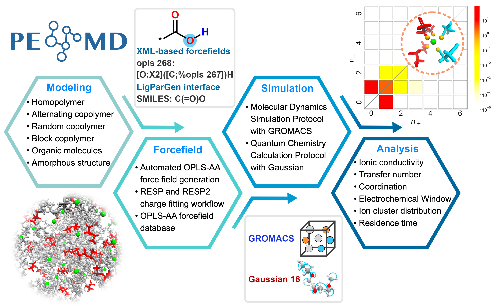

# PEMD

Polymer Electrolyte Modeling and Discovery (PEMD) is a Python package for building, simulating, and analyzing polymer electrolyte systems. It provides workflows for polymer structure generation, OPLS-AA force-field preparation, molecular dynamics simulations, quantum-chemistry calculations, and trajectory analysis.

<p align="center">
  
</p>

## Features

- Build homo- and co-polymer structures from JSON input files.
- Prepare amorphous simulation boxes with Packmol.
- Generate OPLS-AA force-field files from LigParGen, RESP charges, or database parameters.
- Run molecular dynamics workflows with GROMACS, including annealing, production, and Tg simulations.
- Run quantum-chemistry workflows with RDKit, XTB, Gaussian, Multiwfn, and UMA.
- Analyze MD trajectories for conductivity, diffusion, transfer number, coordination, residence time, polymer-ion dynamics, and glass-transition temperature.

## Repository Layout

```text
PEMD/
├── PEMD/                 # Python package
│   ├── core/             # User-facing model, force-field, run, and analysis APIs
│   ├── model/            # Polymer construction and packing utilities
│   ├── forcefields/      # Force-field generation utilities
│   ├── simulation/       # MD and QM wrappers
│   └── analysis/         # Trajectory and property analysis
├── workflow/             # Example workflows and input files
├── data/                 # Example datasets and simulation files
├── bin/                  # Helper scripts
├── environment.yml       # Conda environment
└── setup.py              # Package metadata
```

## Installation

PEMD is developed and tested primarily on Linux. macOS is also supported for workflows where the required external programs are available.

Create the recommended environment:

```bash
conda env create -f environment.yml
conda activate pemd
```

Install PEMD in editable mode:

```bash
pip install -e .
```

For full workflow execution, make sure the required external programs are installed and available in `PATH`, depending on the calculation:

- GROMACS
- Packmol
- Gaussian
- XTB
- Multiwfn

## Quick Start

The MD workflow uses a JSON file to describe the polymer, cation, and anion. See [workflow/md.json](workflow/md.json) for an example.

```python
from pathlib import Path
import shutil

from PEMD.core.forcefields import Forcefield
from PEMD.core.model import PEMDModel
from PEMD.core.run import MDRun

work_dir = Path("demo_md")
work_dir.mkdir(exist_ok=True)
shutil.copy("workflow/md.json", work_dir / "md.json")

json_file = "md.json"

pdb_short, pdb_long = PEMDModel.homopolymer_from_json(work_dir, json_file)

Forcefield.oplsaa_from_json(
    work_dir,
    json_file,
    mol_type="polymer",
    ff_source="ligpargen",
    pdb_file=pdb_long,
)
Forcefield.oplsaa_from_json(work_dir, json_file, mol_type="Li_cation", ff_source="database")
Forcefield.oplsaa_from_json(work_dir, json_file, mol_type="salt_anion", ff_source="database")

PEMDModel.amorphous_cell_from_json(
    work_dir,
    json_file,
    density=0.8,
    add_length=25,
    packinp_name="pack.inp",
    packpdb_name="pack_cell.pdb",
)

MDRun.annealing_from_json(
    work_dir,
    json_file,
    temperature=298,
    T_high_increase=300,
    anneal_rate=0.05,
    anneal_npoints=5,
    packmol_pdb="pack_cell.pdb",
)
MDRun.production_from_json(work_dir, json_file, temperature=298, nstep_ns=200)
```

## Example Workflows

The `workflow/` directory contains runnable examples:

| File | Description |
| --- | --- |
| [workflow/md.py](workflow/md.py) | Polymer construction, force-field generation, packing, annealing, and production MD |
| [workflow/md_withRESP.py](workflow/md_withRESP.py) | MD workflow with RESP charge fitting |
| [workflow/esw.py](workflow/esw.py) | Electrochemical stability window calculation |
| [workflow/frontier_orbitals.py](workflow/frontier_orbitals.py) | HOMO/LUMO analysis from quantum-chemistry output |

Each workflow expects a PEMD-style JSON input file and the external programs required for that calculation.

## Analysis

PEMD includes analysis tools for common polymer electrolyte properties:

- Mean squared displacement and self-diffusion coefficient
- Ionic conductivity
- Cation transfer number
- Radial distribution function and coordination number
- Residence time
- Polymer-ion hopping dynamics
- Glass-transition temperature
- HOMO/LUMO energy and electrochemical stability window

Most trajectory analysis tools are exposed through `PEMD.core.analysis.PEMDAnalysis`.

## Citation

If you use PEMD in published work, please cite:

```bibtex
@article{tan2026pemd,
  title   = {PEMD: An open-source framework for high-throughput simulation and analysis of polymer electrolytes},
  author  = {Tan, Shendong and Liang, Bochun and Lu, Dexin and Ji, Chaoyuan and Jia, Wenke and Li, Zihui and Hou, Tingzheng},
  journal = {Digital Discovery},
  year    = {2026},
  DOI     = {10.1039/D5DD00454C}
}
```

## Contact

For questions or bug reports, contact the PEMD development team at <tsd23@mails.tsinghua.edu.cn>.
